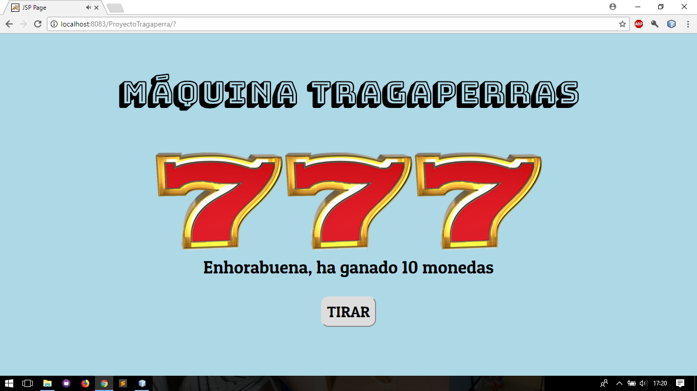
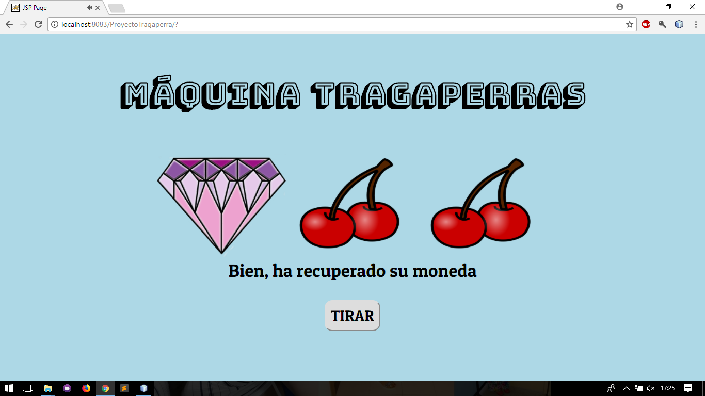

# Tragaperras_JSP

## Este programa simula a una máquina tragaperras

Esta hecho en el IDE
 [Netbeans 8.2](https://netbeans.org/downloads/)
 con el servidor de 
 [Apache Tomcat 8](http://tomcat.apache.org/)
 junto con HTML5 y CSS3

   
   

