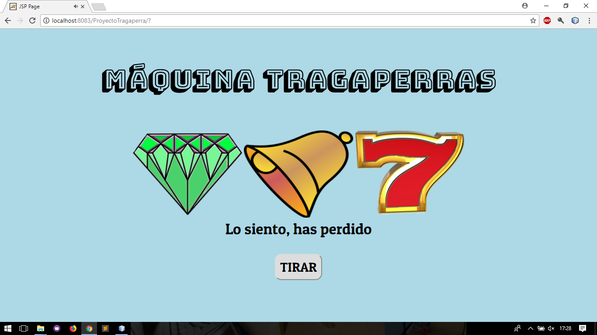

# Tragaperras_JSP

## Este programa simula a una máquina tragaperras

Esta hecho en el IDE [Netbeans 8.2](https://netbeans.org/downloads/) con el
servidor de [Apache Tomcat 8](http://tomcat.apache.org/) junto con HTML5 y CSS3 

   
   

